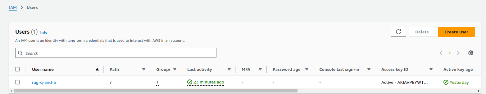
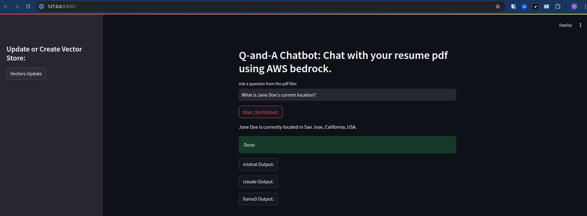

# q-and-a-chatbot

This is a friendly Q-and-A chatbot answering your questions using your PDF documents - A generative AI application built with RAG + LLM.

## Problem Description

The exponential growth in our organization's hiring volume has created significant challenges for our Human Resources department, particularly in the resume screening process. The current applicant tracking system (ATS) is inadequate for efficiently processing the high volume of applications, resulting in the following issues:

- **`Scalability Limitations`**: Our legacy ATS cannot effectively handle the increased influx of resumes, leading to processing bottlenecks and delays in the hiring pipeline.
- **`Inefficient Search Capabilities`**: The existing system lacks advanced search functionalities, making it difficult for recruiters to quickly identify qualified candidates based on specific criteria or skill sets.
- **`Absence of Intelligent Question-Answering`**: The current ATS does not provide an intuitive way for recruiters to query applicant data or extract relevant information from resumes, leading to time-consuming manual reviews.
- **`Limited Context Understanding`**: Traditional keyword-based systems often miss nuanced information or fail to understand the context of an applicant's experience, potentially overlooking qualified candidates.
- **`Inconsistent Screening Process`**: The manual nature of the current system can lead to inconsistencies in how resumes are evaluated across different recruiters or hiring managers.

To address these challenges, we propose developing an advanced Q&A chatbot leveraging Large Language Model (**`LLM`**) technology and implementing a Retrieval-Augmented Generation (**`RAG`**) architecture. This solution aims to:

- Automate and accelerate the initial screening process
- Provide intelligent, context-aware search capabilities
- Enable natural language querying of applicant data
- Ensure consistent and unbiased initial evaluations
- Augment human decision-making in the hiring process

By implementing this LLM-powered chatbot with RAG, we anticipate significantly improving the efficiency and effectiveness of our resume screening process, ultimately leading to faster and more informed hiring decisions.

This project can be easily modified for any other business case using respective knowledge base documents.

## Overview

Chatbots built with RAG can overcome some of the limitations that general-purpose conversational models have. In particular, they are able to discuss and answer questions about:

- Information that is private to your organization.
- Events that were not part of the training dataset, or that took place after the LLM finished training.
- As an additional benefit, RAG helps to "ground" LLMs with facts, making them less likely to make up a response or "hallucinate".

The secret to achieve this is to use a two-step process to obtain an answer from the LLM:

First in the **`Retrieval`** Phase, one or more data sources are searched for the user's query,. The relevant documents that are found in this search are retrieved, enabling you to choose between keyword, dense and sparse vector search methods, or even a hybrid combination of them.

Then in the **`Generation`** Phase, the user's prompt is expanded to include the documents retrieved in the first phase, with added instructions to the LLM to find the answer to the user's question in the retrieved information. The expanded prompt, including the added `context` for the question, is what is sent to the LLM in place of the original query.


## Main Tools Definition

- **`LLMs`**: Large Language Models (LLMs) are advanced artificial intelligence systems trained on vast corpora of text data, capable of understanding and generating human-like text. These models, such as GPT-4, BERT, and LLaMA, utilize deep learning techniques, particularly transformer architectures, to capture complex linguistic patterns and semantic relationships. LLMs excel at various natural language processing tasks, including text generation, summarization, translation, and question-answering. In the context of resume screening, LLMs can comprehend the nuanced content of job applications, interpret qualifications, and generate relevant insights, potentially revolutionizing the efficiency and accuracy of candidate evaluation processes.

- **`RAG`**: Retrieval-Augmented Generation (RAG) is an innovative approach that enhances the capabilities of LLMs by combining their generative power with external knowledge retrieval. In a RAG system, when a query is received, a retrieval component first searches a curated knowledge base for relevant information. This retrieved context is then fed into the LLM along with the original query, allowing the model to generate responses that are both contextually relevant and factually grounded. For resume screening applications, RAG can significantly improve the accuracy and reliability of the chatbot by incorporating up-to-date company-specific information, job requirements, and industry trends, thus providing more precise and tailored responses to recruitment queries.


## Dataset

The project utilizes resume document in PDF format as a knowledge base, stored in the **`data`** directory. A sample resume is provided for testing and demonstration.

Users can expand the dataset by adding or replacing PDF files in this directory to suit specific use cases. Ensure compliance with data privacy regulations when using real resumes containing personal information.


## Technical Stack

- **`AWS Bedrock`**: A fully managed service that provides foundation models from leading AI companies through an API.
- **`LangChain`**: An open-source framework for developing applications powered by language models, facilitating the creation of context-aware AI systems.
- **`Retrievers`**: Components that search and fetch relevant information from a knowledge base or document collection.
- **`Retrieval chain`**: A series of operations that combine document retrieval with language model processing to generate context-aware responses.
- **`Faiss`**: A library developed by Facebook AI for efficient similarity search and clustering of dense vectors.
- **`StreamLit`**: An open-source app framework for Machine Learning and Data Science projects, enabling quick creation of web applications.


## Prerequisites

1. GitHub codespace:

    - Create repo:`q-and-a-chatbot` or use any test repo that you already have
    - Start codespace and connect to it from your IDE e. g. VS Code
    - Clone this repo
    ```
    git clone https://github.com/ranga4all1/q-and-a-chatbot.git
    ```
    Note: You can use any cloud VM or your local system instead of GitHub codespace.

2. Install dependencies listed in `requirements.txt` on the system.
    ```
    pip install -r requirements.txt
    ```

3. AWS Prerequisites:

    - Create the AWS account
    - Create a User in IAM account with below accesses (access can be finetuned, here I have given full access for simplicity).
        - AdministratorAccess
        - AmazonBedrockFullAccess
    - For this IAM user, create `Access key` and `Secret Key`.

    

4. Configure AWSCLI on your system(codespace) by giving the `Access key`, `Secret Key` and `Region`.
    ```
    /workspaces/q-and-a-chatbot (main) $ aws configure
        AWS Access Key ID [None]: <your key ID>
        AWS Secret Access Key [None]: <your secret key>
        Default region name [None]: us-west-2
        Default output format [None]: json
    ```

5. Request access to required LLM models in AWS Bedrock from AWS Management console. Here is the [Link](https://us-west-2.console.aws.amazon.com/bedrock/home?region=us-west-2#/modelaccess) for requesting model access. Here we need following LLM models.

    - `Titan Embeddings G1 - Text` : Required for creating Embeddings
    - `Titan Text G1 - Lite` : LLM model for Text generation
    - `Claude` : For text generation
    - `Llama 3.1 8B Instruct` : For text generation
    - `Mistral 7B Instruct` : For text generation


## Steps to run the application

1. Ensure that all steps from **Prerequisites** section above are completed.

2. Run
```
streamlit run app.py
```
 You can now view your Streamlit app in your browser at http://localhost:8501

3. Test:

    - Click on `Vectors Update` button.
    - Type your question and then click LLM output buttons one at a time to get answers.

    

