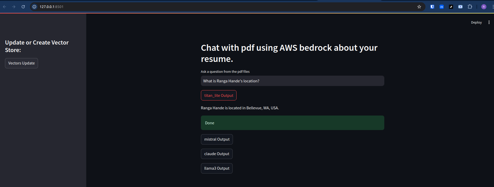

# q-and-a-chatbot

This is a friendly Q-and-A chatbot answering your questions using your PDF documents - A generative AI application built with RAG + LLM.

## Problem Description


## Project overview


## Dataset


## Main Tools Definition

- LLMs:

- RAG:


## Technical Stack

- AWS Bedrock
- LangChain
- Retrievers
- Retrieval chain
- Faiss
- StreamLit


## Prerequisites

1. GitHub codespace:

- Create repo:`q-and-a-chatbot` or use any test repo that you already have
- Start codespace and connect to it from your IDE e. g. VS Code
- Clone this repo
```
git clone https://github.com/ranga4all1/q-and-a-chatbot.git
```
Note: You can use any cloud VM or your local system instead of GitHub codespace.

2. Install dependencies listed in `requirements.txt` on the system.
```
pip install -r requirements.txt
```

3. AWS Prerequisites:

- Create the AWS account
- Create a User in IAM account with below accesses (access can be finetuned, here I have given full access for simplicity).
    - AdministratorAccess
    - AmazonBedrockFullAccess
- For this IAM user, create `Access key` and `Secret Key`.


4. Configure AWSCLI on your system(codespace) by giving the `Access key`, `Secret Key` and `Region`.
```
/workspaces/q-and-a-chatbot (main) $ aws configure
    AWS Access Key ID [None]: <your key ID>
    AWS Secret Access Key [None]: <your secret key>
    Default region name [None]: us-west-2
    Default output format [None]: json
```

5. Request access to required LLM models in AWS Bedrock from AWS Management console. Here is the [Link](https://us-west-2.console.aws.amazon.com/bedrock/home?region=us-west-2#/modelaccess) for requesting model access. Here we need following LLM models.

- `Titan Embeddings G1 - Text` : Required for creating Embeddings
- `Titan Text G1 - Lite` : LLM model for Text generation
- `Claude` : For text generation
- `Llama 3.1 8B Instruct` : For text generation
- `Mistral 7B Instruct` : For text generation


## Steps to run the application

1. Ensure that all steps from **Prerequisites** section above are completed.

2. Run
```
streamlit run app.py
```
 You can now view your Streamlit app in your browser at http://localhost:8501

3. Test:

    - Click on `Vectors Update` button.
    - Type your question and then click LLM output buttons one at a time to get answers.



